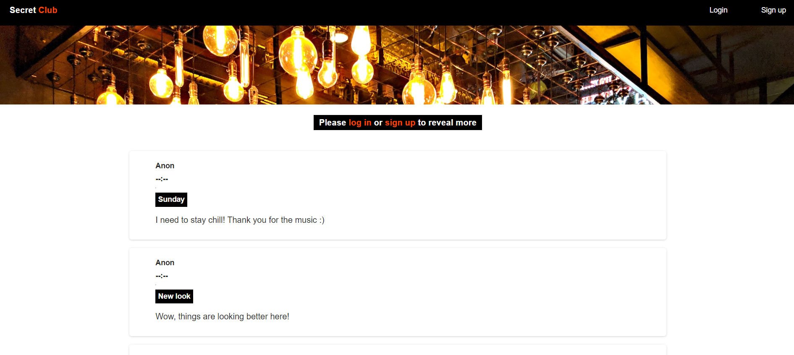

# Member-Only-Club

The Clubhouse Anonymous Posts project aims to create an exclusive clubhouse where members can write anonymous posts. Inside the clubhouse, members can identify the authors of the posts, while outside viewers can only read the stories without knowing the authors' identities. This project focuses on implementing authentication and database management skills.

# Screenshot

# Technologies Used

- MongoDB
- Node.js
- Express.js
- bcrypt
- Passport.js
- Heroku

# Features

- User Registration: Users can sign up using a username and password.
- Message Creation: Signed-in users can create posts with a title, timestamp, and text.
- Anonymous Display: Outside viewers can see a list of all messages without knowing the authors' identities.
- Membership Status: Users can join the club by entering a secret passcode, which grants them membership status.
- Login System: Users can log in securely using passport.js authentication.

